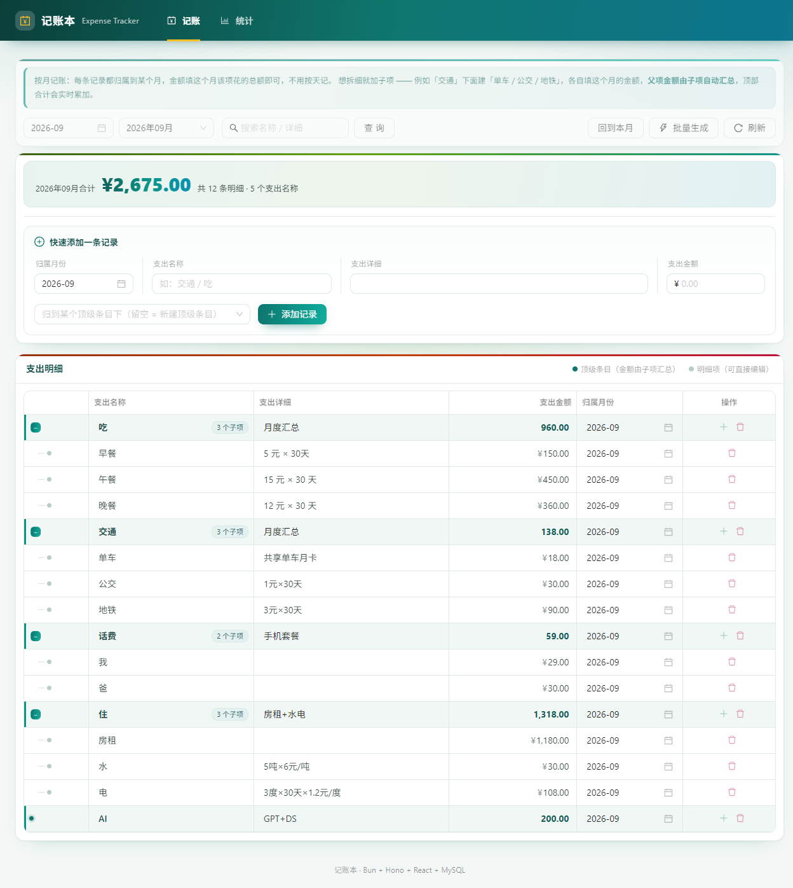
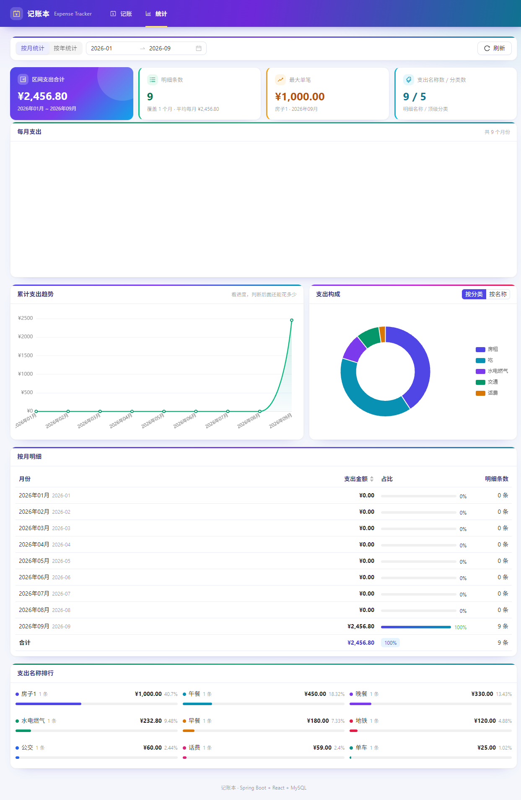

# 记账本 · Expense Tracker

一个**按月记账**、支持**子项拆分**与**父项自动汇总**的记账 Web 应用。

> 大多数记账 App 假设你愿意每天记一笔。但如果你只想**一个月盘一次账**——
> 把「吃 960」「交通 205」这样一个月填一行就完事，这个项目就是为这个场景写的。

- **后端**：Java 17 + Spring Boot 3.2 + Spring Data JPA
- **前端**：React 18 + Vite + Ant Design 5 + ECharts
- **数据库**：MySQL 8
- **部署**：Docker Compose 一键启动（MySQL + 后端 + nginx 前端）

## 特性

- **按月记账** —— 一条记录 = 某个月里的一项支出，不用天天记
- **子项拆分** —— 「交通」下面挂「单车 / 公交 / 地铁」，各自填当月金额
- **父项自动汇总** —— 父项金额由子项实时算出，不落库，父子永远不会对不上
- **就地编辑** —— 表格里点任意单元格直接改，不用打开编辑弹窗
- **按月批量生成** —— 「房租」这类固定支出，一次铺满 12 个月，重复的自动跳过
- **统计** —— 按月/按年切换，柱状图 + 累计趋势 + 构成饼图 + 排行
- **老库自动迁移** —— 从按天记账的旧版本升级不用手动改库

## 界面

**记账页**



**统计页**



---

## 一、记账方式（先看这个）

核心思路：**一条记录 = 某个月里的一项支出**。金额填这个月的总额，不填每日明细。

| 支出名称 | 支出详细 | 支出金额 | 归属月份 |
| --- | --- | --- | --- |
| 吃 | （5+15）*30 | 960.00 | 2026-09 |
| 交通 | 单车 25 + 公交 60 + 地铁 120 | 205.00 | 2026-09 |
| 房租 | 每月固定 | 3200.00 | 2026-09 |

「支出详细」是自由文本，你想写算式说明（`（5+15）*30`）、想写构成说明，都可以，
它只是给人看的备注，**不影响金额计算**。

### 想拆细就加子项

「交通」这种一笔说不清的，点那一行右边的「＋」加子项：

```
交通                      ← 支出名称（父项）
├── 单车   25.00           ← 子项，各自填这个月的金额
├── 公交   60.00
└── 地铁   120.00
```

父项金额由子项**自动汇总**（上面例子 = 205），蓝色显示，不用也不能手填。

层级**只开放两层**：顶级条目 → 子项。子项上不再显示「＋」，父项下拉也只列顶级条目
（后端同样做了校验，绕过界面直接调接口也会被拒）。两级已经够表达
「交通 → 单车/公交/地铁」这类结构，而定死两层能让表格缩进、列宽、金额对齐始终保持整齐。

「＋」只出现在顶级条目那一行的右侧。

### 三个输入项 + 两个辅助项

页面顶部快速记账区：**归属月份 / 支出名称 / 支出详细 / 支出金额**，
下面是「归属父项」（可留空 = 新建顶级条目）和「添加记录」按钮。

**每加一行，顶部合计金额立即累加**；直接在表格里改金额，合计也会立刻重算。

表格里**每一行的单元格都能就地编辑**（点一下就能改）：支出详细、支出金额、归属月份都可以改。
有子项的父项，它的「支出详细」同样可以手写（比如写「单车25 + 公交60 + 地铁120」），
留空时那一格会显示灰字提示，列出它下面的子项名称。

金额列的显示规则（父子项外观不同，但**数字都对齐在同一条右基准线上**）：

| 行 | 金额外观 | 能否改 |
|---|---|---|
| 父项 —— 任何有子项的节点 | 蓝色粗体，不带 ¥ | 只读（金额 = 子项自动汇总） |
| 父项 —— 顶级条目但还没建子项 | 蓝色粗体，不带 ¥ | **点击数字即可改**（加了子项后自动转为汇总） |
| 子项 —— 非顶级的明细行 | 常规黑色，带 ¥ | 点击数字即可改 |

> 金额格**不响应鼠标滚轮**（antd 输入框默认「悬停滚动即改值」，容易在滚动页面时误改金额，已显式关掉）。

### 按月批量生成（省事用）

房租、话费这种每月都有的，不用一个月一个月地填：
点「**按月批量生成**」，支出名称填「房租」、子项写 3200、月份选 2026-01 ~ 2026-12，
一次生成 12 条（一个月一条）。已存在的月份自动跳过，可以放心重复点。

详细文本支持 `{period}` `{month}` `{name}` `{parent}` 占位符。

---

## 二、统计

「统计」页可以切 **按月统计 / 按年统计**，区间用月份区间选择器（预设：本月 / 上月 / 近3个月 / 近半年 / 今年 / 去年）。

包含：

- 汇总卡片：区间支出合计、明细条数（覆盖 N 个月 · 平均每月）、最大单笔、支出名称数 / 分类数
- 每月支出柱状图（或按年）
- 累计支出趋势折线（看全年花了多少、什么时候被拉高的）
- 支出构成饼图（可切「按分类 / 按名称」）
- 按月 / 按年明细表（金额、占比、条数、合计行）
- 支出名称排行（前 12 名 + 占比进度条）

### 汇总规则（重要）

- **只有叶子节点（最底层那一行）的金额是真实数据**，需要你手填。
- **有子项的父项金额 = 所有子项之和**，实时计算、不落库。
- 统计只算叶子节点，所以**永远不会出现父子重复累加、或父子对不上的脏数据**。

---

## 三、目录结构

```
expense-tracker/
├── backend/                        # Spring Boot 后端
│   ├── src/main/java/com/ledger/
│   │   ├── controller/             # REST 接口
│   │   ├── service/                # 业务逻辑（树构建、汇总、统计）
│   │   ├── repository/             # JPA Repository
│   │   ├── entity/ExpenseRecord    # 支出记录实体（自关联树，按月）
│   │   ├── dto/                    # 请求 / 响应对象
│   │   ├── common/Periods          # 月份工具（yyyy-MM 归一化）
│   │   └── config/SchemaMigration  # 启动时在线迁移（老库自动升级）
│   ├── src/main/resources/application.yml
│   ├── maven-settings.xml          # 阿里云 Maven 镜像（加速构建）
│   └── Dockerfile
├── frontend/                       # React 前端
│   ├── src/pages/LedgerPage.jsx    # 记账页（表单 + 树形表格）
│   ├── src/pages/StatsPage.jsx     # 统计页（按月 / 按年 + 图表）
│   ├── src/components/Chart.jsx    # ECharts 封装
│   ├── src/api/index.js            # 接口封装
│   ├── nginx.conf                  # 静态资源 + /api 反向代理
│   └── Dockerfile
├── deploy/mysql/
│   ├── init.sql                    # 建表脚本（数据卷为空时自动执行，不含数据）
│   └── demo-data.sql               # 可选示例数据（6 个月，需手动灌入）
├── docs/screenshots/               # README 用截图
├── docker-compose.yml              # 一键编排
├── .env.example                    # 环境变量模板（复制成 .env 后改）
├── start.bat / start.sh            # 一键启动脚本
├── stop.bat                        # 停止脚本
├── README.md
├── DEPLOY.md                       # 部署详解与排错
└── LICENSE
```

---

## 四、一键启动（Docker）

> 前置条件：已安装 Docker Desktop，且引擎处于运行状态。

**Windows：** 双击 `start.bat`

**或者手动执行：**

```bash
cd expense-tracker
docker compose up -d --build
```

启动后浏览器打开：**http://localhost:8088**

首次构建需要下载依赖 + 编译，大约 3~8 分钟；之后再启动是秒级。

常用命令：

```bash
docker compose ps                 # 查看容器状态
docker compose logs -f backend    # 看后端日志
docker compose logs -f frontend   # 看前端日志
docker compose down               # 停止（数据保留）
docker compose down -v            # 停止并删除数据卷（清空所有数据）
docker compose up -d --build      # 改代码后重新构建启动
```

端口和密码都在 `.env` 里改。仓库里只放了模板，第一次用先复制一份：

```bash
cp .env.example .env
```

```ini
WEB_PORT=8088          # 网页端口
MYSQL_PORT=3307        # 数据库映射到宿主机的端口（避开本机已装的 3306）
MYSQL_PASSWORD=change_me
```

> `.env` 已加入 `.gitignore`，你自己的密码不会被提交上去。

镜像里**不含任何示例数据**。想看效果可以先灌一份（6 个月的假账）：

```bash
docker exec -i ledger-mysql mysql -uroot -p"$MYSQL_ROOT_PASSWORD" expense_tracker < deploy/mysql/demo-data.sql
```

详细部署说明、内网镜像加速、数据备份、迁移到服务器，见 **[DEPLOY.md](./DEPLOY.md)**。

---

## 五、本地开发（不用 Docker）

### 1. 起一个 MySQL

```sql
CREATE DATABASE expense_tracker DEFAULT CHARSET utf8mb4 COLLATE utf8mb4_unicode_ci;
```

### 2. 启动后端

```bash
cd backend
mvn spring-boot:run
# 默认连 localhost:3306 / 库 expense_tracker / 用户 root / 密码 root
```

需要改连接信息就用环境变量，不用改配置文件：

```bash
DB_HOST=localhost DB_PORT=3306 DB_NAME=expense_tracker DB_USER=root DB_PASSWORD=你的密码 mvn spring-boot:run
```

后端跑在 http://localhost:8080 ，健康检查：`GET /api/health`

### 3. 启动前端

```bash
cd frontend
bun install
bun run dev
```

打开 http://localhost:5173 ，Vite 已配置 `/api` 代理到 8080，前后端联调无需处理跨域。

### 4. 手动打包

```bash
# 后端：产出 backend/target/expense-tracker-backend.jar
cd backend && mvn clean package -DskipTests

# 前端：产出 frontend/dist/
cd frontend && bun run build
```

---

## 六、接口一览

后端统一返回 `{ success, message, data }`。

| 方法 | 路径 | 说明 |
| --- | --- | --- |
| GET | `/api/health` | 健康检查 |
| GET | `/api/records/tree?from=&to=&keyword=` | 树形列表（记账页主数据），`from`/`to` 为月份 `yyyy-MM` |
| GET | `/api/records/leaves?from=&to=&keyword=` | 扁平明细（仅叶子节点） |
| GET | `/api/records/options?period=` | 所有节点（父项下拉），传 `period` 只看该月 |
| GET | `/api/records/periods` | 现有月份列表（倒序） |
| POST | `/api/records` | 新增一条记录 |
| PUT | `/api/records/{id}` | 局部更新（只改传过来的字段） |
| DELETE | `/api/records/{id}` | 删除记录（连同所有子孙） |
| POST | `/api/records/batch` | 按月批量生成（子项 × 月份区间） |
| GET | `/api/stats?from=&to=&granularity=month\|year` | 统计聚合 |

**新增请求体：**

```json
{
  "parentId": null,
  "name": "吃",
  "detail": "（5+15）*30",
  "amount": 960.00,
  "period": "2026-09"
}
```

**局部更新请求体**（只提交要改的字段，其它字段保持不变）：

```json
{ "amount": 980.00 }
```

**按月批量生成请求体：**

```json
{
  "parentName": "房租",
  "items": [{ "name": "房租", "detail": "每月固定", "amount": 3200 }],
  "fromPeriod": "2026-01",
  "toPeriod": "2026-12",
  "detailTemplate": "{period} {name}",
  "skipExisting": true
}
```

---

## 七、数据库表

```sql
CREATE TABLE expense_record (
  id         BIGINT        NOT NULL AUTO_INCREMENT,
  parent_id  BIGINT        NULL,                -- 父项ID，NULL = 顶级
  name       VARCHAR(64)   NOT NULL,            -- 支出名称
  detail     VARCHAR(255)  NULL,                -- 支出详细（自由文本）
  amount     DECIMAL(12,2) NOT NULL DEFAULT 0,  -- 支出金额（叶子节点有效，按月）
  period     VARCHAR(7)    NULL,                -- 归属月份 yyyy-MM
  sort_order INT           NULL DEFAULT 0,
  created_at DATETIME      NULL,
  updated_at DATETIME      NULL,
  PRIMARY KEY (id),
  KEY idx_parent_id (parent_id),
  KEY idx_period (period),
  KEY idx_name (name)
) ENGINE=InnoDB DEFAULT CHARSET=utf8mb4 COLLATE=utf8mb4_unicode_ci;
```

单表 + 自关联，不存冗余金额，父项汇总实时算出来，所以永远不会出现「父项和子项对不上」的脏数据。

### 从「按天记录」的旧版本升级

旧版本用的是 `expense_date`（具体日期）字段。**不用手动改库**：
应用启动时会自动把老数据的 `period` 按日期推导出来（`2026-09-15` → `2026-09`），
然后删掉不再使用的日期列。整个过程幂等，可以反复启动。

日志里会看到：

```
[migration] 按 expense_date 回填 period 共 N 行
[migration] 已移除历史列 expense_date
```

---

## 八、License

[MIT](./LICENSE) © 2026 juranranranran

随意使用、修改、商用，保留版权声明即可。
