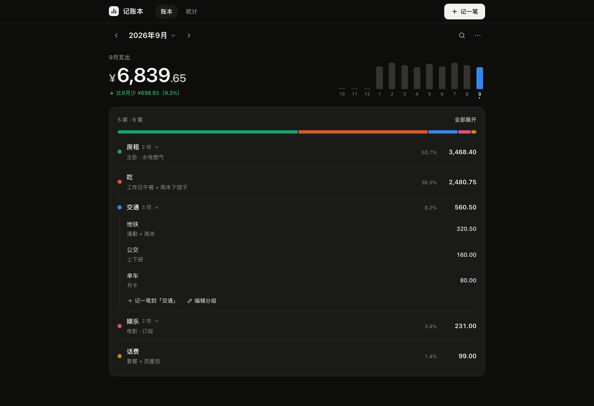
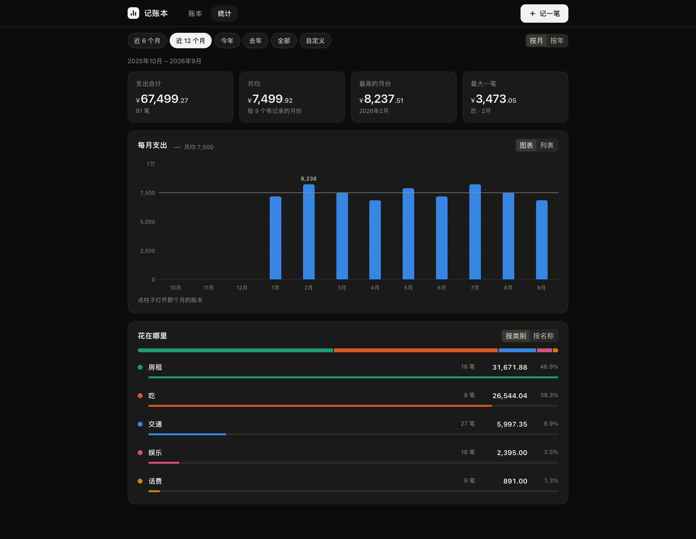
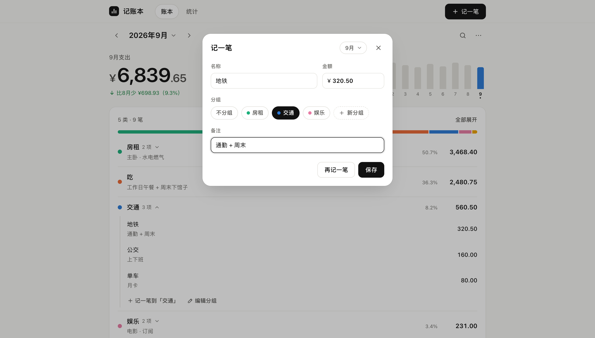
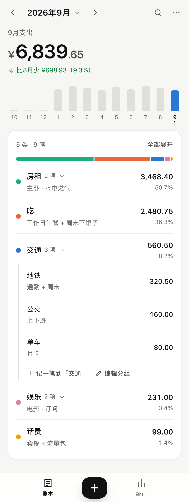
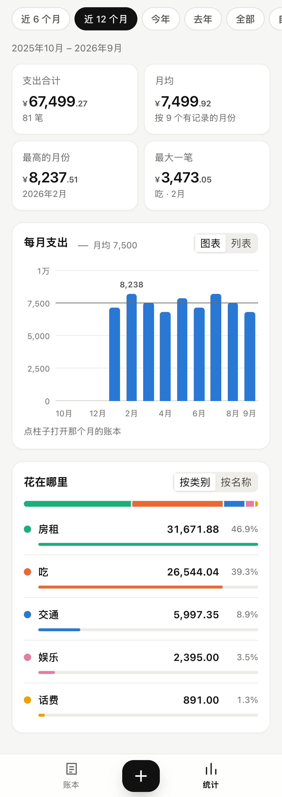

# 记账本 · Expense Tracker

一个**按月记账**的 Web 应用：同类支出放进分组，分组金额自动汇总。

> 大多数记账 App 假设你愿意每天记一笔。但如果你只想**一个月盘一次账**——
> 把「吃 960」「交通 205」这样一个月填一行就完事，这个项目就是为这个场景写的。

- **后端**：Bun + Hono + Drizzle ORM + Zod
- **前端**：React 18 + Vite + Ant Design 5（图表直接用 HTML/CSS 画，不引图表库）
- **数据库**：MySQL 8
- **部署**：Docker Compose 一键启动（MySQL + 后端 + nginx 前端）

全栈 TypeScript，前后端**共用同一份类型定义**（`packages/shared`）：
接口字段改了，两边同时编译不过，不会出现「后端改了字段、前端还在按老字段取值」的情况。

## 特性

- **按月记账** —— 一条记录 = 某个月里的一项支出，不用天天记
- **分组** —— 「交通」下面放「单车 / 公交 / 地铁」，分组金额由组里各项实时汇总、不落库，永远对得上
- **近 12 个月一眼看完** —— 账本顶部的迷你柱状图就是月份导航，点哪根柱子跳到哪个月；比上月多花还是少花直接写出来
- **钱花在哪** —— 一条占比条 + 按金额排好的明细，圆点颜色和占比条一一对应，同一个类别在哪个页面都是同一个颜色
- **从上月复制** —— 新的一个月点一下就沿用上个月的全部条目，再逐项改金额；已有的同名条目自动跳过
- **记一笔更快** —— 名称联想带出上次的分组和金额；「再记一笔」连续录入；快捷键 `N` 记一笔、`←` `→` 翻月、`/` 搜索
- **跨月搜索** —— 在全部月份里搜名称和备注，按月分组并给出合计：「今年地铁一共花了多少」一搜就有
- **删除可撤销** —— 删除不弹确认框，6 秒内点「撤销」原样恢复（分组连同组里的各项）
- **统计** —— 近 6 / 12 个月、今年、去年、全部或自定义；按月 / 按年；点柱子直接打开那个月的账本
- **深色模式** —— 跟随系统
- **手机单独布局** —— 导航和「记一笔」放在拇指够得着的底栏，面板从底部滑出
- **老库自动迁移** —— 从按天记账的旧版本升级不用手动改库

## 界面

极简配色：界面只用墨色和暖灰，彩色只留给数据（类别颜色、选中的月份）。浅色 / 深色跟随系统。

**账本**

| 浅色 | 深色 |
| --- | --- |
|  |  |

**统计**

| 浅色 | 深色 |
| --- | --- |
|  |  |

**记一笔**

| 桌面 | 手机 |
| --- | --- |
|  |  |

**手机**

| 账本 | 统计 |
| --- | --- |
|  |  |

---

## 一、记账方式（先看这个）

核心思路：**一条记录 = 某个月里的一项支出**。金额填这个月的总额，不填每日明细。

| 名称 | 备注 | 金额 | 月份 |
| --- | --- | --- | --- |
| 吃 | （5+15）*30 | 960.00 | 2026-09 |
| 交通 | 单车 25 + 公交 60 + 地铁 120 | 205.00 | 2026-09 |
| 房租 | 每月固定 | 3200.00 | 2026-09 |

备注是自由文本，写算式、写构成说明都行，它只是给人看的，**不影响金额计算**。

### 同类的放进分组

「交通」这种一笔说不清的，记的时候在「分组」里选「交通」，没有就点「新分组」：

```
交通                      ← 分组，金额自动汇总（= 205）
├── 单车   25.00
├── 公交   60.00
└── 地铁   120.00
```

- 分组金额由组里各项**自动汇总**，不用也不能手填
- 层级**只有两层**：分组 → 条目（后端同样做了校验，绕过界面直接调接口也会被拒）
- 把一笔**已经有金额的独立支出**变成分组时（比如「吃 2480」下面再记一笔「午餐」），
  原来的 2480 会自动保留成组里的一项，合计不会凭空少掉一截

### 日常怎么用

- **记一笔**：右上角的按钮（手机在底栏中间），或者按 `N`。名称会联想记过的条目，选中后自动带出上次的分组和金额
- **改 / 删**：点列表里任意一行。删除不弹确认，底部提示里点「撤销」就能恢复
- **翻月**：`←` `→`、标题两边的箭头，或者直接点顶部近 12 个月的柱子；点月份标题会弹出整年的月份格子，每格带当月合计
- **新的一个月**：空月份会提示「从上月复制」，一键沿用上个月的条目再改金额
- **搜索**：按 `/`，在全部月份里搜名称和备注

### 批量生成（多个月一次记）

房租、话费这种每月都有的，点右上角「⋯ → 批量生成到多个月」：分组填「房租」，
条目写「主卧 3200」，月份选 9 月到 12 月，一次生成 4 条。
已经有同名记录的月份自动跳过，可以放心重复点。

备注模板支持 `{period}` `{month}` `{name}` `{parent}` 占位符。

---

## 二、统计

时间范围：近 6 个月 / 近 12 个月 / 今年 / 去年 / 全部 / 自定义，可切**按月 / 按年**。
筛选条件写在地址栏里，刷新不丢，也能直接把链接发给别人。

- 四个数字：支出合计、月均、最高的月份、最大一笔
- 每月支出柱状图 + 月均线：点柱子打开那个月的账本（按年统计时，点柱子展开那一年的每个月）；
  可以切成「列表」看精确数字
- 花在哪里：按类别（顶级条目）或按名称排行，类别颜色和账本里一致

### 汇总规则（重要）

- **只有叶子节点（最底层那一行）的金额是真实数据**，需要你手填。
- **有子项的父项金额 = 所有子项之和**，实时计算、不落库。
- 统计只算叶子节点，所以**永远不会出现父子重复累加、或父子对不上的脏数据**。

---

## 三、目录结构

```
expense-tracker/                    # Bun workspaces 单仓
├── packages/shared/                # 前后端共享层
│   └── src/
│       ├── types.ts                # 响应体类型（不依赖 zod，前端零运行时代价）
│       ├── schemas.ts              # 请求体校验规则（仅服务端加载）
│       ├── period.ts               # 月份规则 yyyy-MM（两边共用同一个定义）
│       └── money.ts                # 金额按整数分运算，避免浮点漂移
├── server/                         # Bun + Hono 后端
│   └── src/
│       ├── domain/                 # 纯业务逻辑，不碰数据库，可直接单测
│       │   ├── tree.ts             # 树构建 / 过滤 / 路径 / 级联
│       │   ├── stats.ts            # 统计聚合
│       │   ├── batch.ts            # 按月批量生成的规划器
│       │   └── copy.ts             # 整月复制的规划器
│       ├── db/
│       │   ├── schema.ts           # Drizzle 表定义
│       │   ├── bootstrap.ts        # 幂等建表 + 老库在线迁移
│       │   ├── mysql.ts            # MySQL 仓储实现
│       │   └── memory.ts           # 内存仓储（测试 / 无库演示）
│       ├── services/               # 编排：取数 → 纯逻辑 → 落库
│       ├── routes/                 # Hono 路由 + Zod 校验
│       └── *.test.ts               # bun test
├── frontend/                       # React 前端
│   ├── src/state/ledger.tsx        # 全局账本状态：一次拉取，切月 / 搜索都在本地完成
│   ├── src/lib/ledger.ts           # 纯计算：每月合计、类别配色、搜索、名称联想（有单测）
│   ├── src/pages/LedgerPage.tsx    # 账本：月份导航 + 概览 + 明细
│   ├── src/pages/StatsPage.tsx     # 统计：时间范围 + 柱状图 + 排行
│   ├── src/components/             # 记账面板、月份格子、柱状图、占比条……
│   ├── src/api/index.ts            # 接口封装
│   ├── nginx.conf                  # 静态资源 + /api 反向代理
│   └── Dockerfile
├── deploy/mysql/
│   ├── init.sql                    # 建表脚本（数据卷为空时自动执行，不含数据）
│   └── demo-data.sql               # 可选示例数据（6 个月，需手动灌入）
├── docs/screenshots/               # README 用截图
├── docker-compose.yml              # 一键编排
├── .env.example                    # 环境变量模板（复制成 .env 后改）
├── start.bat / start.sh            # 一键启动脚本
├── stop.bat                        # 停止脚本
├── README.md
├── DEPLOY.md                       # 部署详解与排错
└── LICENSE
```

---

## 四、一键启动（Docker）

> 前置条件：已安装 Docker Desktop，且引擎处于运行状态。

**Windows：** 双击 `start.bat`

**或者手动执行：**

```bash
cd expense-tracker
docker compose up -d --build
```

启动后浏览器打开：**http://localhost:8088**

首次构建需要下载依赖 + 编译，大约 3~8 分钟；之后再启动是秒级。

常用命令：

```bash
docker compose ps                 # 查看容器状态
docker compose logs -f server     # 看后端日志
docker compose logs -f frontend   # 看前端日志
docker compose down               # 停止（数据保留）
docker compose down -v            # 停止并删除数据卷（清空所有数据）
docker compose up -d --build      # 改代码后重新构建启动
```

端口和密码都在 `.env` 里改。仓库里只放了模板，第一次用先复制一份：

```bash
cp .env.example .env
```

```ini
WEB_PORT=8088          # 网页端口
MYSQL_PORT=3307        # 数据库映射到宿主机的端口（避开本机已装的 3306）
MYSQL_PASSWORD=change_me
```

> `.env` 已加入 `.gitignore`，你自己的密码不会被提交上去。

镜像里**不含任何示例数据**。想看效果可以先灌一份（6 个月的假账）：

```bash
docker exec -i ledger-mysql mysql -uroot -p"$MYSQL_ROOT_PASSWORD" expense_tracker < deploy/mysql/demo-data.sql
```

详细部署说明、内网镜像加速、数据备份、迁移到服务器，见 **[DEPLOY.md](./DEPLOY.md)**。

---

## 五、本地开发（不用 Docker）

### 1. 起一个 MySQL

```sql
CREATE DATABASE expense_tracker DEFAULT CHARSET utf8mb4 COLLATE utf8mb4_unicode_ci;
```

### 2. 安装依赖（在仓库根目录执行一次即可）

```bash
bun install
```

### 3. 启动后端

```bash
bun run server
```

默认连 `localhost:3306` / 库 `expense_tracker` / 用户 `root` / 密码 `root`。
改连接信息用环境变量，不用改配置文件：

```bash
DB_HOST=localhost DB_PORT=3306 DB_NAME=expense_tracker DB_USER=root DB_PASSWORD=你的密码 bun run server
```

后端跑在 http://localhost:8080 ，健康检查：`GET /api/health`

**手上没有 MySQL？** 用内存模式直接把界面跑起来看效果（数据重启即失，别用来记真账）：

```bash
DB_DRIVER=memory SEED_DEMO=1 bun run server
```

### 4. 启动前端

```bash
bun run web
```

打开 http://localhost:5173 ，Vite 已配置 `/api` 代理到 8080，前后端联调无需处理跨域。

### 5. 跑测试

```bash
bun test
```

146 个用例，覆盖月份归一化、金额整数分运算、树构建与过滤、批量生成和整月复制的判重、
统计聚合、全部 HTTP 接口的契约，以及前端的纯计算（每月合计、类别配色、搜索、名称联想）。
业务逻辑都是纯函数，测试不需要数据库，也不需要浏览器。

### 6. 手动打包

前端产出 `frontend/dist/`：

```bash
bun run --filter expense-tracker-frontend build
```

后端不需要打包 —— Bun 直接执行 TypeScript 源码。

---

## 六、接口一览

后端统一返回 `{ success, message, data }`。

| 方法 | 路径 | 说明 |
| --- | --- | --- |
| GET | `/api/health` | 健康检查 |
| GET | `/api/records/tree?from=&to=&keyword=` | 树形列表（记账页主数据），`from`/`to` 为月份 `yyyy-MM` |
| GET | `/api/records/leaves?from=&to=&keyword=` | 扁平明细（仅叶子节点） |
| GET | `/api/records/options?period=` | 所有节点（父项下拉），传 `period` 只看该月 |
| GET | `/api/records/periods` | 现有月份列表（倒序） |
| POST | `/api/records` | 新增一条记录 |
| PUT | `/api/records/{id}` | 局部更新（只改传过来的字段） |
| DELETE | `/api/records/{id}` | 删除记录（连同所有子孙） |
| POST | `/api/records/batch` | 按月批量生成（子项 × 月份区间） |
| POST | `/api/records/copy` | 整月复制：把 `from` 月的全部记录复制到 `to` 月，已有的同名条目跳过 |
| GET | `/api/stats?from=&to=&granularity=month\|year` | 统计聚合 |

**新增请求体：**

```json
{
  "parentId": null,
  "name": "吃",
  "detail": "（5+15）*30",
  "amount": 960.00,
  "period": "2026-09"
}
```

**局部更新请求体**（只提交要改的字段，其它字段保持不变）：

```json
{ "amount": 980.00 }
```

**按月批量生成请求体：**

```json
{
  "parentName": "房租",
  "items": [{ "name": "房租", "detail": "每月固定", "amount": 3200 }],
  "fromPeriod": "2026-01",
  "toPeriod": "2026-12",
  "detailTemplate": "{period} {name}",
  "skipExisting": true
}
```

**整月复制请求体**（返回 `{ created, skipped, totalAmount }`）：

```json
{ "from": "2026-08", "to": "2026-09" }
```

---

## 七、数据库表

```sql
CREATE TABLE expense_record (
  id         BIGINT        NOT NULL AUTO_INCREMENT,
  parent_id  BIGINT        NULL,                -- 父项ID，NULL = 顶级
  name       VARCHAR(64)   NOT NULL,            -- 支出名称
  detail     VARCHAR(255)  NULL,                -- 支出详细（自由文本）
  amount     DECIMAL(12,2) NOT NULL DEFAULT 0,  -- 支出金额（叶子节点有效，按月）
  period     VARCHAR(7)    NULL,                -- 归属月份 yyyy-MM
  sort_order INT           NULL DEFAULT 0,
  created_at DATETIME      NULL,
  updated_at DATETIME      NULL,
  PRIMARY KEY (id),
  KEY idx_parent_id (parent_id),
  KEY idx_period (period),
  KEY idx_name (name)
) ENGINE=InnoDB DEFAULT CHARSET=utf8mb4 COLLATE=utf8mb4_unicode_ci;
```

单表 + 自关联，不存冗余金额，父项汇总实时算出来，所以永远不会出现「父项和子项对不上」的脏数据。

### 从「按天记录」的旧版本升级

旧版本用的是 `expense_date`（具体日期）字段。**不用手动改库**：
应用启动时会自动把老数据的 `period` 按日期推导出来（`2026-09-15` → `2026-09`），
然后删掉不再使用的日期列。整个过程幂等，可以反复启动。

日志里会看到：

```
[migration] 按 expense_date 回填 period 共 N 行
[migration] 已移除历史列 expense_date
```

---

## 八、License

[MIT](./LICENSE) © 2026 juranranranran

随意使用、修改、商用，保留版权声明即可。
